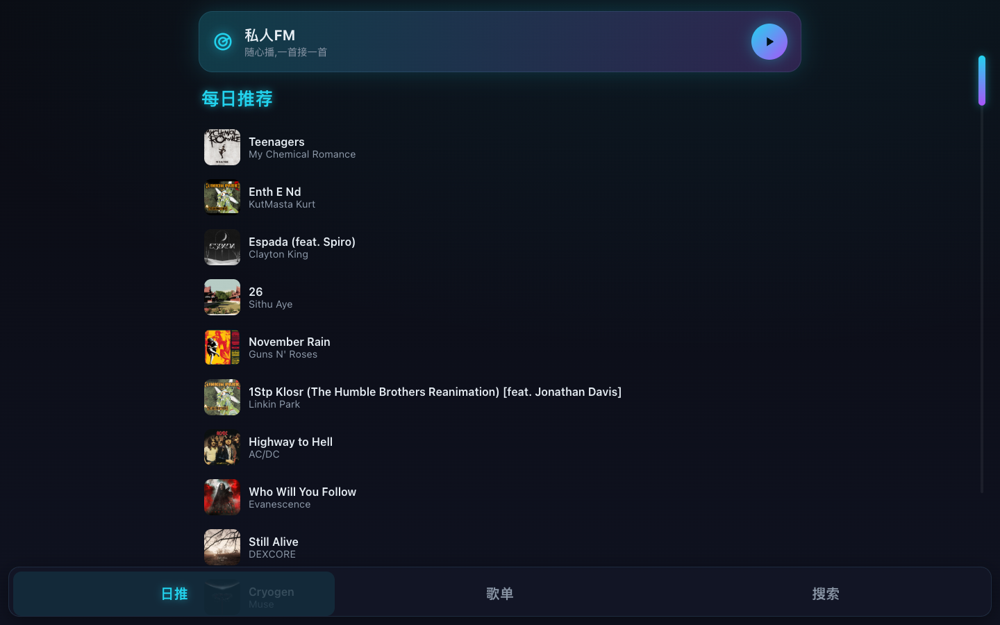
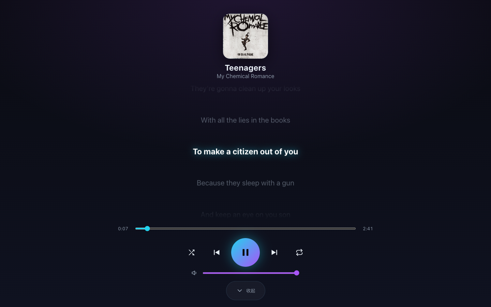
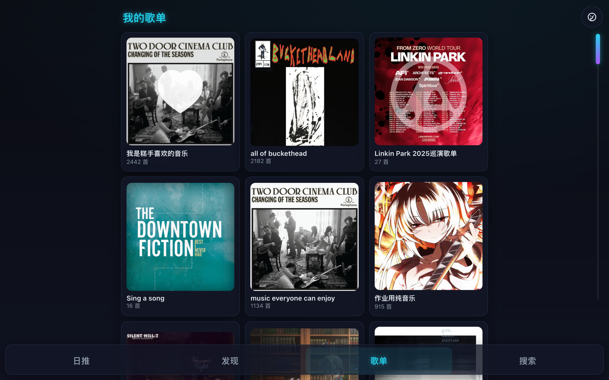

# TeslaNetEaseMusic

[简体中文](README.md) · **English** · [日本語](README.ja.md)

[](LICENSE)

A self-hosted online player for Tesla owners who cannot access NetEase Cloud Music while abroad. Each user deploys their own instance, signs in with their own account, and plays their library — with driving-friendly scrolling lyrics — in the car's browser.

## Overview

- **Self-hosted** — every user runs an independent instance; no shared data.
- **Credential isolation** — the login cookie is stored only in a server-side volume; neither the frontend nor the car's browser ever holds it.
- **Optimized for the car** — large controls, dark high-contrast UI, karaoke-style scrolling lyrics; centered and split layouts, and swipe-to-change-track, suited to driving.
- **Public access** — a bundled Cloudflare Tunnel provides an HTTPS URL without a public IP.

## Features

- Daily recommendations, your playlists, search, Personal FM (a personalized radio stream)
- Playback controls: play/pause, previous/next, shuffle, repeat, seek, volume
- Karaoke-style scrolling lyrics with translation; instrumentals show a placeholder
- Two now-playing layouts (centered / split); the split view has a draggable divider to resize the lyrics area, and the lyric font scales with its width
- Driving-friendly: swipe to change track (left→right next, right→left previous), enlarged controls and mini-player buttons
- Themes: five color schemes, plus an "auto" mode that switches light/dark by your real sunrise and sunset
- Album and artist pages, play queue, likes
- Remembers the last queue, position, volume, and settings
- Media Session integration so the car's system media card shows cover art and track info

## Screens

| Home · Personal FM | Now Playing · Lyrics | Your Playlists |
|---|---|---|
|  |  |  |

## Architecture

- **Frontend** — Vite + React + TypeScript, built as static assets.
- **BFF** — a Node/Express service that handles QR login, stores the cookie server-side, and injects the session when proxying requests.
- **Music API** — the NetEase API served by an `ncm-api` container.
- **Orchestration** — Docker Compose starts the services; an optional Cloudflare Tunnel exposes an HTTPS URL.

## Deployment

Three host environments are supported. Full instructions are in [DEPLOY.md](DEPLOY.md).

| Environment | Method | Notes |
|---|---|---|
| Mac / local computer | [Mac one-liner](DEPLOY.md#mac) | Fastest to deploy; the computer must stay on while in use |
| Synology NAS | [NAS deploy](DEPLOY.md#nas) | Always on, fixed address, no public IP required |
| VPS / cloud server | [VPS deploy](DEPLOY.md#vps) | Stable, fixed address |

### Quick start

On a Mac with Docker installed:

```bash
git clone https://github.com/JovanCai/TeslaNetEaseMusic.git
cd TeslaNetEaseMusic
./deploy.sh
```

The script starts the service, guides you through QR login on your phone, and prints an `https://…` public URL. Open that URL in the Tesla's browser to start playing.

## Configuration

Settings are provided through a `.env` file in the project root. Redeploy after changing them.

| Variable | Default | Description |
|---|---|---|
| `APP_PORT` | `80` | The public service port; change it if the port is already in use |
| `REGION_UNLOCK` | `false` | Region unlock. When enabled, the backend sends requests from a random China IP to play **licensed** tracks that gray out abroad; relies on your own account's rights |
| `ENABLE_UNBLOCK` | `false` | Gray-track substitution. When enabled, a same-title track from sources such as QQ or Kugou is played instead; matches may differ in version or audio quality |

## Maintenance

- **Re-login / switch account** — run `./relogin.sh`, then scan again.
- **Update** — one command, `./update.sh`: pulls the prebuilt image and restarts, no local build on the deployment host; the login is preserved.

## Privacy & security

- Each instance is deployed by the user and signed in to their own NetEase account.
- The login cookie lives only in a server-side volume — never in frontend code, browser storage, or a URL.
- Playback depends on your own account's rights; region unlock is off by default, and enabling it is your decision.
- **Anyone who opens the public URL lands in your logged-in session** — put a login gate in front of it, e.g. Cloudflare Access (see the "Security" section in [DEPLOY.md](DEPLOY.md)).

## License

Released under [AGPL-3.0](LICENSE). Design and implementation docs are in `docs/`.
