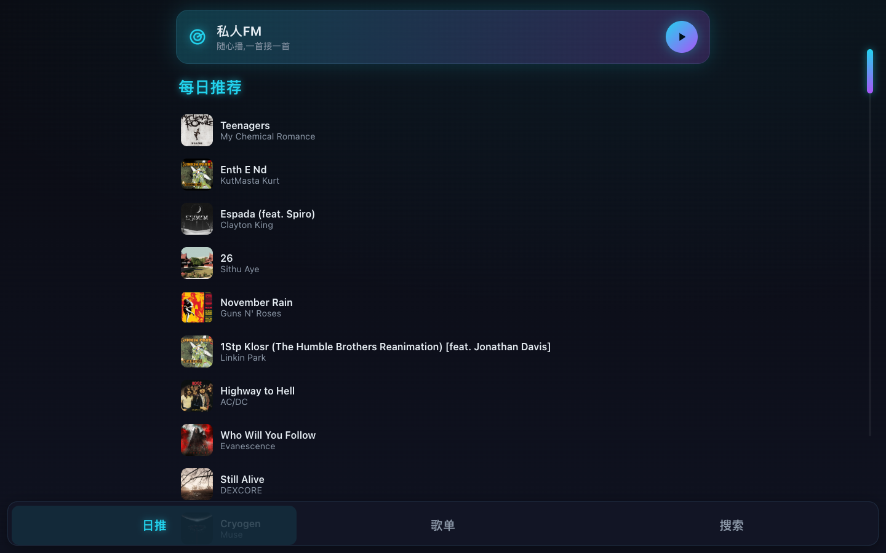
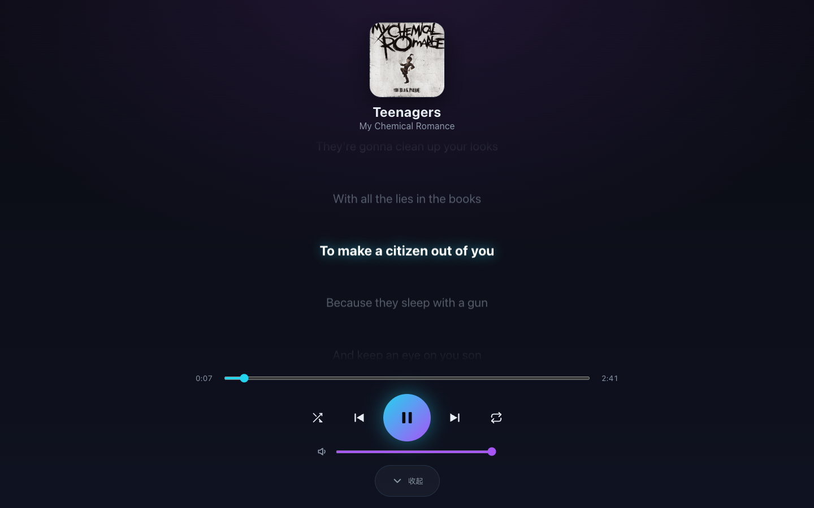
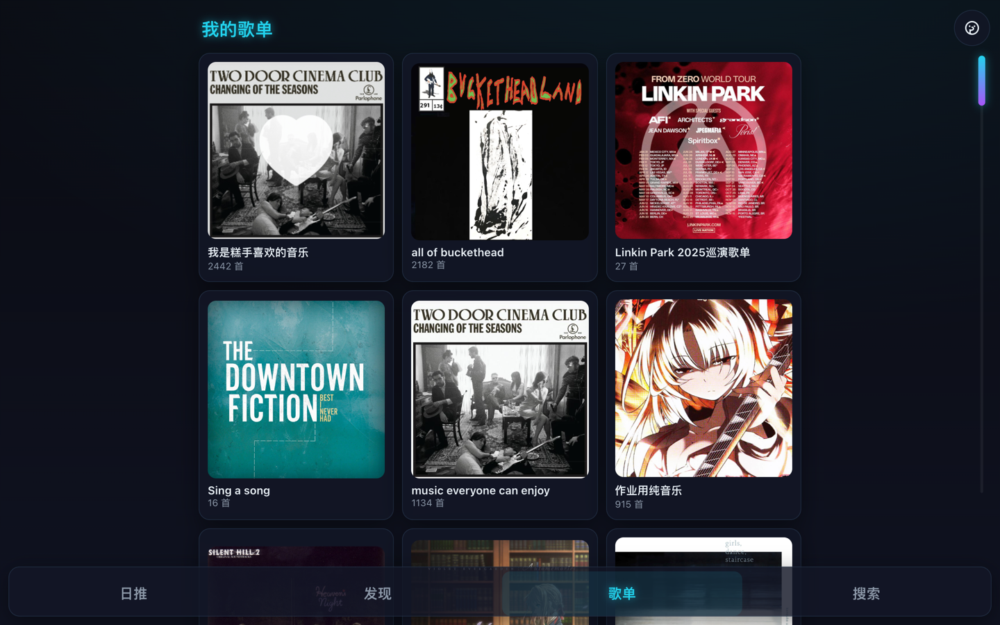

# TeslaNetEaseMusic

[简体中文](README.md) · [English](README.en.md) · **日本語**

> 海外で網易雲音楽(NetEase Cloud Music)を利用できない Tesla オーナーのために作られたオンラインプレーヤー。

セルフホスト型。自分のアカウントでログインし、車載ブラウザで歌詞をスクロール表示しながら聴けます。

**機能**
- デイリーおすすめ / 自分のプレイリスト / 検索 / パーソナル FM(次々と流れるパーソナライズド・ラジオ)
- 再生 / 一時停止 / 前へ / 次へ / シャッフル / リピート / シーク / 音量
- カラオケ風のスクロール歌詞。インストゥルメンタルは「纯音乐 · 请欣赏(純音楽・お楽しみください)」と表示
- 大きなボタン、暗く高コントラストな UI で運転中も押しやすい。前回の曲と音量を記憶

## 画面

| ホーム · パーソナルFM | 再生画面 · 歌詞 | プレイリスト |
|---|---|---|
|  |  |  |

---

## 動かし方

手元の機器に合わせて選んでください。詳しい手順は [DEPLOY.md](DEPLOY.md) にあります。

| 状況 | 方法 | 特徴 |
|---|---|---|
| **Mac / PC** で試す | [Mac ワンコマンド](DEPLOY.md#mac) | 最速。数分で車で開ける。運転中は PC を起動したままにする必要あり |
| **Synology NAS** がある | [NAS で構築](DEPLOY.md#nas) | 常時稼働・固定アドレス。**グローバル IP 不要** |
| **VPS / クラウド** がある | [VPS で構築](DEPLOY.md#vps) | 安定・固定アドレス |

一番早い試し方(Docker 入りの Mac で):

```bash
git clone https://github.com/JovanCai/TeslaNetEaseMusic.git
cd TeslaNetEaseMusic
./deploy.sh
```

スクリプトがサービスを起動し、スマホで QR コードを読み取ってログインさせ、最後に `https://…` の URL を表示します。その URL を **Tesla のブラウザ**で開けば再生できます。

---

## よくある質問

- **再ログイン / アカウント切り替え**:`./relogin.sh` を実行して再度スキャン。
- **新バージョンへ更新**:`git pull` してから `./deploy.sh`(ログイン状態は保持されます)。
- **80 番ポートが使用中**:`.env` に `APP_PORT=8080`(空いている別ポート)を設定。
- **海外でグレーの曲を聴く**(どちらも既定でオフ。ご自身の判断で。変更後は再デプロイ):
  - 権利はあるが海外でグレーになる曲:`.env` に `REGION_UNLOCK=true`(バックエンドがランダムな中国 IP を自動使用。自分のアカウントの権利に依存)。
  - 権利のないグレー曲:`.env` に `ENABLE_UNBLOCK=true`(QQ/Kugou などから同名曲を代替再生)。マッチが別バージョンになったり音質がまちまちになることがあります。

---

## プライバシーと著作権

- 各自が自分のコピーを動かし、自分の NetEase アカウントでログインします。
- ログイン Cookie は自分のサーバーのボリュームにのみ保存され、車載ブラウザには残りません。
- 再生は自分のアカウントの権利に依存します。リージョン解除は既定でオフで、有効化はご自身の判断です。

## ライセンス

[AGPL-3.0](LICENSE)。設計・実装ドキュメントは `docs/` にあります。
